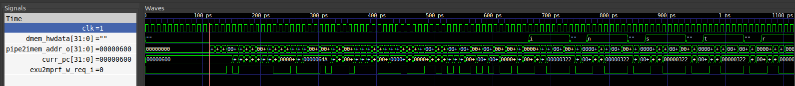
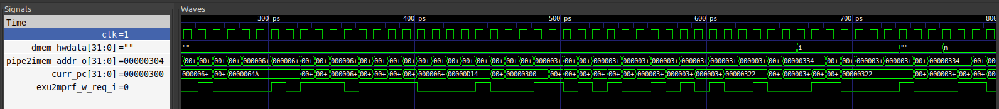
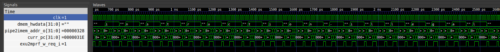

# Лабораторная работа 2. Симуляция SCR1

## Постановка задачи
Обработать исключение IllegalInstruction выводом строки "instruction-illegal". Настроить ресет вектор и вектор обработки прерываний на 0x600 и 0x3500 соответственно. Проверить работу программы на примере isa/rv32mi/illegal.S.

## Последовательнось действий при выполнении лабораторной

* Были сделаны модификации в файле _scr1/sim/tests/riscv_isa/rv32_tests.inc_, заключающиеся в удалении ненужных тестов
* В терминале были настроены пути до компилятора для RISC-V и верилятора
* Модифицированы вектора прерываний и ресетов в файле _scr1/src/includes/scr1_arch_description.svh_
* Модифицирован скрипт линковщика _scr1/sim/tests/common/link.ld_ для правильной сборки проекта 
* Был собран проект в режиме генерации wave форм командой в терминале: _make run_verilator_wf TARGETS="riscv_isa"_, результат в виде файла _simx.vcd_ сохранён в папку _results_
* В папке с результатом сборки проекта командой  _gtkwave ./simx.vcd_ была выведена вейвформа, было настроено отображение вевформ и настройки сохранены в файл _wf_settings.gtkw_, сохранённый в созданную раннее папку _results_
* Помимо раннее описанных файлов в папку _results_ также сохранены результат симуляции (_test_results.txt_), дизассемблированный дамп кода теста (_illegal.dump_), трейс лог (_tracelog_core_0.log_)

## Результат выполнения

Проверим правильность настройки линкер-скрипта, рассмотрим дамп теста (_illegal.dump_):

~~~
...
00000300 <trap_vector>:
 300:	34202773          	csrr	a4,mcause
 304:	47a1                	li	a5,8
 306:	04f70263          	beq	a4,a5,34a <_report>
 30a:	47a5                	li	a5,9
 30c:	02f70f63          	beq	a4,a5,34a <_report>
 310:	47ad                	li	a5,11
 312:	02f70c63          	beq	a4,a5,34a <_report>
 316:	f0000837          	lui	a6,0xf0000
 31a:	00001897          	auipc	a7,0x1
 31e:	9e688893          	addi	a7,a7,-1562 # d00 <MSG_TRAP>
...
00000600 <_start>:
 600:	f1402573          	csrr	a0,mhartid
 604:	e101                	bnez	a0,604 <_start+0x4>
 606:	4e01                	li	t3,0
 608:	00000297          	auipc	t0,0x0
 60c:	cf828293          	addi	t0,t0,-776 # 300 <trap_vector>
 610:	30529073          	csrw	mtvec,t0
 614:	4505                	li	a0,1
 616:	057e                	slli	a0,a0,0x1f
 618:	00054863          	bltz	a0,628 <_start+0x28>
...
~~~
Как мы видим по дампу, трап и ресет вектор были настроены.

Рассмотрим вейвформу, найдём на ней трап и ресет вектор, а также выведенное сообщение.

На курсоре виден ресет вектор

На курсоре виден трап вектор за несколько инструкций до вывода сообщения

Наблюдаем вывод сообщения
