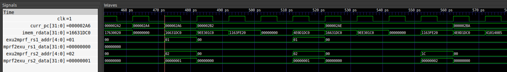
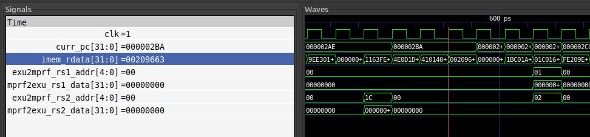
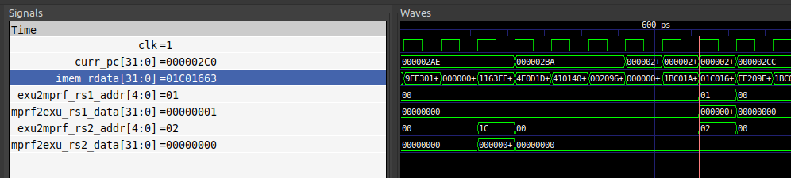

# Лабораторная работа 3. (дополнительное задание)

## Постановка задачи
Познакомиться с архитектурой пайплайна SCR1. Доработать тестбенч для вывода информации об микроархитектурном состоянии и состоянии конвеера при выполении определенной команды.

## Последовательнось действий при выполнении лабораторной

* Были сделаны модификации в файле _scr1/sim/tests/riscv_isa/rv32_tests.inc_, заключающиеся в удалении ненужных тестов
* В терминале были настроены пути до компилятора для RISC-V и верилятора
* Был добавлен несинтезируемый блок описанный на System Verilog _bne_detect.sv_ в папку _scr1/src/tb_
* В файлe тестбенча scr1 _scr1/src/tb/scr1_top_tb_ahb.sv_ инстанциирован добавленный несинтезируемый блок
* Для того чтобы проект нашёл новый блок в файле _scr1/src/ahb_tb.files_ добален путь к _bne_detect.sv_
* Был собран проект в режиме генерации wave форм командой в терминале: _make run_verilator_wf TARGETS="riscv_isa" TRACE=1_, результат в виде файла _simx.vcd_ сохранён в папку _report_
* В папке с результатом сборки проекта командой  _gtkwave ./simx.vcd_ была выведена вейвформа, было настроено отображение вевформ и настройки сохранены в файл _wf_set.gtkw_, сохранённый в созданную раннее папку _report_
* Помимо раннее описанных файлов в папку _results_ также сохранены вывод отладочного модуля (_sim_results.txt_), дизассемблированный дамп кода теста (_bne.dump_)

## Результат выполнения

Проверим правильность отлавливания команды. Рассмотрим дамп теста:

~~~
...
00000200 <_start>:
 200:	f1402573          	csrr	a0,mhartid
 204:	e101                	bnez	a0,204 <_start+0x4>
 206:	4e01                	li	t3,0
 208:	00000297          	auipc	t0,0x0
 20c:	fb828293          	addi	t0,t0,-72 # 1c0 <trap_vector>
 210:	30529073          	csrw	mtvec,t0
 214:	4505                	li	a0,1
 216:	057e                	slli	a0,a0,0x1f
 218:	00054863          	bltz	a0,228 <_start+0x28>
 21c:	0ff0000f          	fence
 220:	85f2                	mv	a1,t3
 222:	4501                	li	a0,0
 224:	00000073          	ecall
 228:	00000293          	li	t0,0
 22c:	00028d63          	beqz	t0,246 <_start+0x46>
 230:	10529073          	csrw	stvec,t0
 234:	62ad                	lui	t0,0xb
 236:	10928293          	addi	t0,t0,265 # b109 <__global_pointer$+0xa3c1>
 23a:	30229073          	csrw	medeleg,t0
 23e:	30202373          	csrr	t1,medeleg
 242:	fa6293e3          	bne	t0,t1,1e8 <handle_exception>
 246:	30005073          	csrwi	mstatus,0
 24a:	00000297          	auipc	t0,0x0
 24e:	05628293          	addi	t0,t0,86 # 2a0 <_run_test>
 ...
000002a0 <_run_test>:
 2a0:	4e09                	li	t3,2
 2a2:	4081                	li	ra,0
 2a4:	4105                	li	sp,1
 2a6:	00209663          	bne	ra,sp,2b2 <_run_test+0x12>
 ...
~~~
Как мы видим по дампу, первый раз выполняется инструкция bne, когда PC = 2a6. На вейвформе мы должны наблюдать в регистре _imem_rdata_ (данные чтения памяти инструкций) значение x00209663 как видно из дампа

Рассмотрим вейвформу, найдём на ней момент запроса на выполнение инструкции

На курсоре видно значение PC равное 2a6 - момент, когда из памяти запрашивается инструкция _bne	ra,sp,2b2_

Найдём момент загрузки команды

На курсоре видно значение PC равное 2ba и значение инструкции x00209663, чего мы и ожидали

Проверим, смог ли отладочный блок перехватить данный момент, рассмотрим вывод отладочного модуля в _sim_results.txt_

~~~
scr1_top_tb_ahb
0;34m---Test:                          bne.hex 0m
BNE instruction detected, Program Counter = 2ba
...
~~~

Отладочный блок выполнил поставленную задачу.

Осталось только рассмотреть момент выполнения инструкции, что мы наблюдаем на следующей картинке

На курсоре виден момент, когда значения адресов регистров, с которыми работает процессор равно x01 и x02, что соответсвует ra и sp 

